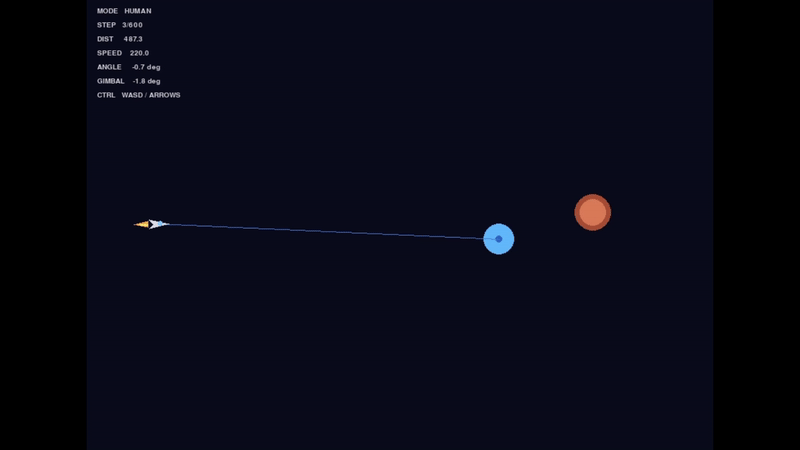

# Rocket Guidance via Reinforcement Learning

A reinforcement learning agent trained to intercept a moving, evasive target in a custom 2D physics environment. The agent controls a continuously thrusting rocket using only nozzle gimbal rate — a single continuous input that deflects thrust over time — and must intercept the target before fuel runs out.



---

## Background

The main goal was to get an agent to learn how to control an interceptor and see if it could adapt and intercept a moving target. 

The idea came from watching footage of an aerospace defense system struggling to track unpredictably moving targets. The system appeared rigid and heavily rule-based, which led me to wonder whether reinforcement learning could adapt more effectively to changing behavior.

The problem is that there's no off-the-shelf environment for this. Generic RL benchmarks stuff like pendulum, lunar lander, MuJoCo arms, humanoids. These are already well-supported and well-documented, but they're also everywhere. I wanted to work on something that required building from the ground up: a custom problem, a custom environment, and a guidance agent that had to learn interception behavior without being told how.

Before jumping to a full 3D simulator like Isaac Lab, the approach was to get an abstract version working first. A 2D Gymnasium environment with realistic TVC physics, a five-stage curriculum, and observations grounded in real guidance system principles. The idea was to validate the approach in a simpler space before scaling it up.

---

## Problem

The agent controls a rocket in a 2D arena. Its only control input is nozzle gimbal rate — a single continuous value that deflects the nozzle, creating torque that rotates the body and redirects thrust over time. The goal is to intercept a moving, evasive target with the rocket's nose tip before fuel runs out.

**Constraints:**
- Single control input: gimbal rate (continuous, `[-1, 1]`)
- No throttle: constant thrust while fuel remains
- Realistic TVC physics: gimbal creates torque only, thrust always along body axis
- Crossflow aerodynamic drag: prevents sideways momentum exploits
- Observations restricted to physically obtainable onboard signals only

---

## Project Structure

```
.
├── environment/        # Custom Gymnasium environment (physics + rendering)
├── rl-agent/           # Training and evaluation scripts
│   ├── train.py        # PPO training with curriculum and VecNormalize
│   └── evaluate.py     # Evaluation against scripted and human-controlled targets
├── models/             # Saved checkpoints from each curriculum stage
├── docs/
│   ├── story.md        # Full development narrative from scratch to stage 3
│   └── insights.md     # Key technical lessons learned
└── README.md
```

---

## Environment

Built from scratch in Python using Gymnasium and Pygame. The 900×650 arena places the rocket on the left with the target spawning in a configurable region depending on curriculum stage.

**Physics model:**
- Thrust acts exclusively along the rocket body axis
- Gimbal deflection generates torque → angular velocity → heading change → thrust redirection
- Crossflow drag attenuates velocity components perpendicular to the body axis (12% per step), forcing weathervaning
- Gravity applied continuously
- Fuel budget of 700 units with a small steering cost per step

**Observation space (19 dimensions):**
- Rocket position, velocity, orientation (cos/sin encoded), angular velocity
- Relative target position and velocity
- Distance to target, heading error
- Line-of-sight (LOS) rate — angular velocity of the missile-to-target line
- Closing velocity — rate of distance reduction to target
- Obstacle proximity features
- Normalized fuel remaining

All observations are physically obtainable by onboard sensors. No privileged information (future target position, ground-truth target acceleration) is included.

---

## Training

**Algorithm:** PPO via Stable-Baselines3, MLP policy (64×64, tanh), CPU training

**Key hyperparameters:**
```
learning_rate = 1e-4
n_steps       = 2048
batch_size    = 64
n_epochs      = 10
gamma         = 0.99
gae_lambda    = 0.95
clip_range    = 0.2
ent_coef      = 0.005
n_envs        = 8
```

**Observation normalization:** VecNormalize (observations only, `norm_reward=False`). Model checkpoints and normalization statistics are always saved together via a custom `SaveVecNormalizeCallback` to prevent evaluation mismatch.

---

## Curriculum

Training progresses through five stages of increasing difficulty, each fine-tuned from the previous stage's checkpoint.

| Stage | Target Behavior               | Obstacles | Key Challenge                            |
|-------|-------------------------------|-----------|------------------------------------------|
| 0     | Static                        | 0         | Basic intercept geometry, arc trajectory |
| 1     | Static → drift mid-episode    | 0         | Target reacquisition                     |
| 2     | Vertical bounce (predictable) | 0         | Lead angle, 1D periodic tracking         |
| 3     | Perpendicular evasion         | 1         | Active evasion + obstacle avoidance      |
| 4     | Aggressive evasion            | 2         | Sharp dodges, committed lead pursuit     |
| 5     | Evasion + obstacle luring     | 2–3       | Target uses obstacles as shields         |

Stages requiring significant behavioral restructuring (moving-target transitions) use near-scratch entropy coefficients rather than conservative fine-tuning, because the policy's strategy — not just its magnitude — must change.

---

## Reward Design

The reward function is structured so that the progress signal dominates all penalties combined. Early iterations with penalty-heavy designs caused the agent to converge on inaction as the optimal strategy.

```
Primary:    progress toward target (distance reduction, normalized)
Secondary:  alignment, smooth control, LOS rate (proportional navigation signal)
Penalties:  obstacle proximity, gimbal rate, angular velocity
Terminal:   +30 hit, -8 obstacle, -6 out of bounds, -4 fuel out, -2 timeout
```

If penalties can outweigh progress at the dominant operating point, the agent learns to do nothing. Progress must dominate unambiguously, especially early in training.

---

## Results

**Stage 3 (evasive target + 1 obstacle):** ~76% hit rate against scripted evasion

**Human-controlled evaluation:** A human operator controlling the target with WASD keys required between 130 and 150 episodes across repeated 10-episode runs before achieving a full run with zero hits. The policy landed at least one hit in every run prior to that — against a human with full visual information and deliberate evasive intent.

**Emergent behavior:** The agent independently developed lead pursuit and curved intercept trajectories consistent with Proportional Navigation — the classical guidance law used in real interceptor systems — without being explicitly programmed with it. This emerged from an LOS rate penalty in the reward that incentivized minimizing angular line-of-sight drift.

---

## Key Challenges

**Thrust-redirect exploit** — Gimbal angle was incorrectly added to the thrust direction vector, allowing the policy to redirect thrust at arbitrary angles without physically rotating the body. Fixed by separating thrust (body axis only) from torque (gimbal only).

**Crossflow glide exploit** — Policy built lateral momentum through prior steering then coasted sideways toward the target. Fixed with crossflow aerodynamic drag.

**Reward inversion** — Penalty terms collectively exceeded the progress signal, making inaction the optimal strategy. Fixed by rebalancing the reward hierarchy.

**VecNormalize mismatch** — Best model checkpoint was paired with end-of-training normalization statistics, corrupting evaluation. Fixed with a synchronized checkpoint callback.

**Target freeze bug** — Evasive target computed dodge direction from position delta, which oscillated under missile micro-steering and caused the target to freeze. Fixed by computing dodge direction from missile velocity vector instead.

---

## Limitations

- 2D simulation only
- No sensor noise (planned for post-curriculum domain randomization)
- No classical PN baseline for comparison
- Partial generalization across untrained stages

---

## Future Work

- Complete stages 4–5 of the curriculum
- Add domain randomization: Gaussian noise on LOS rate, quantization error on position, lag on angular velocity — to harden the policy for sim-to-real transfer
- Implement a proportional navigation baseline for benchmarking
- Extend to 3D in NVIDIA Isaac Lab

---

## Tech Stack

Python · Gymnasium · Stable-Baselines3 · PyTorch · NumPy · Pygame

---

## Documentation

- [`docs/story.md`](docs/story.md) — complete development narrative from PPO from scratch to stage 3
- [`docs/insights.md`](docs/insights.md) — distilled technical lessons and design principles
